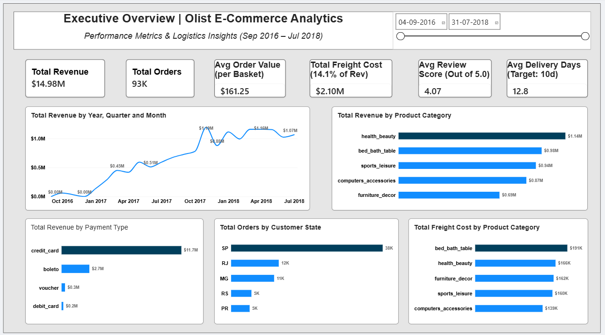

# E-Commerce Customer & Revenue Decision Intelligence System

An end-to-end analytics project analyzing **$14.98M** in tracked revenue across **93K orders** (Sep 2016 – Jul 2018, Olist Brazilian E-Commerce dataset) to drive revenue optimization, customer retention, and logistics performance — from relational schema design through to an interactive Power BI dashboard.

---

## 📌 Executive Summary & Key Highlights

- **Revenue Architecture:** Modeled 9 raw source tables into a normalized MySQL schema, then a Power BI star schema (4 dimension tables, 4 fact tables) for enterprise KPI reporting.
- **Logistics Performance:** Identified an average delivery time of **12.8 days vs. an internal 10-day target** — a 28% operational buffer lag worth investigating against review score trends (association observed; causal testing not yet performed).
- **Customer Retention:** Built cohort construction and month-over-month retention matrix views, plus a repeat-purchase-rate and LTV analysis — see `sql/08`–`10`. *[Insert your actual repeat purchase rate and retention % once you've pulled the query output.]*
- **Revenue Concentration:** health_beauty leads all categories at $1.14M, with the top 5 categories combined generating over $4.6M.
- **Payment Channel Risk:** Credit cards account for 78.3% of total tracked revenue ($11.7M of $14.98M) — a single-channel dependency worth monitoring.

---

## 📊 Dashboard Overview



---

## 🛠️ Tech Stack & Architecture

- **Database:** MySQL — schema design (DDL), referential integrity, KPI aggregation, cohort/retention views, window functions
- **Data Engineering & Analysis:** Python (`pandas`, `sqlalchemy`, `matplotlib`, `seaborn`) — CSV inspection, ingestion, environment verification, exploratory analysis, anomaly investigation, Power BI data export
- **Business Intelligence:** Power BI — star-schema data modeling, DAX measures, interactive executive dashboard
- **Documentation:** Executive Report (PDF, in `documentation/`)

---

## 📁 Repository Structure
```text
├── sql/
│   ├── 01_create_database.sql              # Database creation
│   ├── 02_create_tables.sql                # DDL for all 9 source tables
│   ├── 03_data_quality_verification.sql    # Row-count verification across all tables
│   ├── 04_metric_grain_mapping.sql         # Revenue reconciliation across item/payment grain
│   ├── 05_core_kpi_engine.sql              # Core KPIs: orders, revenue, AOV, ARPU
│   ├── 06_revenue_engine_validation.sql    # Payments vs. order-items variance check
│   ├── 07_logistics_customer_experience.sql # Delivery gap, late-delivery %, review score impact
│   ├── 08_cohort_construction.sql          # Customer acquisition cohort view
│   ├── 09_cohort_retention_matrix.sql      # Month-over-month retention matrix
│   └── 10_ltv_repeat_behavior.sql          # Repeat purchase rate & customer LTV
├── python/
│   ├── 01_inspect_csvs.py                  # Source file inspection
│   ├── 02_ingest_data.py                   # CSV -> MySQL ingestion
│   ├── 03_verify_env.py                    # Environment & connection verification
│   ├── 04_exploratory_analysis.py          # EDA: distributions, trends
│   ├── 05_investigate_anomalies.py         # Structural/business anomaly checks
│   └── 06_export_powerbi_data.py           # Export star-schema tables for Power BI
├── powerbi/
│   └── Olist_ECommerce_Analytics.pbix      # Interactive Power BI dashboard
├── powerbi_data/                           # Star-schema extracts
├── documentation/
│   └── Ecommerce_Project_Report.pdf        # Full executive report
└── outputs/
    └── dashboard_overview.png              # Dashboard preview image


---

## 🔁 Analytical Workflow

1. **Schema design & ingestion** (`sql/01–03`, `python/01–02`) — 9 source tables modeled with primary/foreign keys, loaded into MySQL, verified for row-count and referential integrity.
2. **Revenue reconciliation** (`sql/04–06`) — cross-checked revenue at item-level vs. payment-level grain to confirm a single trustworthy KPI definition before building any dashboard measure on top of it.
3. **Exploratory analysis & anomaly detection** (`python/03–05`) — distribution checks, delivery-time outliers, missing-review investigation.
4. **Core KPI & logistics analysis** (`sql/05, 07`) — orders, revenue, AOV, ARPU, delivery gap, and late-delivery rate, all calculated at the `delivered`-status grain to avoid inflating metrics with cancelled/unavailable orders.
5. **Cohort, retention & LTV** (`sql/08–10`) — customers grouped into acquisition-month cohorts (using `customer_unique_id` to correctly deduplicate repeat customers across orders), a month-over-month retention matrix, and repeat-purchase/LTV calculations.
6. **Power BI modeling** (`python/06`, `powerbi/`) — star schema with 4 dimension and 4 fact tables, DAX measures validated against the SQL outputs above.

---

## 🔑 Key Insights

1. **Revenue Concentration** — health_beauty leads all categories at $1.14M, with the top 5 categories combined generating over $4.6M; prioritizing marketing/inventory toward these could outperform broader catalog-wide investment.
2. **Payment Channel Risk** — Credit cards represent 78.3% of tracked revenue, creating a single-processor concentration risk.
3. **Regional Demand Dominance** — São Paulo accounts for 38K orders, more than 3x the next-highest state (Rio de Janeiro, 12K).
4. **Delivery SLA Gap** — Average delivery time (12.8 days) runs 28% over the 10-day internal target; association with review scores (4.07/5.0 average) observed but not yet causally tested.
5. **Freight/Revenue Mismatch** — bed_bath_table carries the highest freight cost ($191K) despite ranking second in revenue, suggesting category-specific shipping inefficiency worth a packaging/carrier audit.

*[Add cohort retention %, repeat purchase rate, and seller concentration findings here once you've confirmed the exact output of `sql/08–10` and your seller-level query.]*

---

## ⚙️ Setup & Reproduction

1. Clone the repository and install dependencies: `pandas`, `sqlalchemy`, `pymysql`, `matplotlib`, `seaborn`.
2. Create a local MySQL database and run `sql/01_create_database.sql` and `sql/02_create_tables.sql`.
3. Set your database password as an environment variable — **never hardcode it in a script**: 
   - Windows: `set OLIST_DB_PASSWORD=your_password`
   - macOS/Linux: `export OLIST_DB_PASSWORD=your_password`
4. Run the Python scripts in order (`01` → `06`) to ingest data and export the star-schema tables.
5. Open `powerbi/Olist_ECommerce_Analytics.pbix` in Power BI Desktop and refresh the data source.

---

## 📄 Full Report & Links

- **Executive Report (PDF):** `documentation/Ecommerce_Project_Report.pdf`
- **GitHub Repository:** https://github.com/A12Dutta/ecommerce-revenue-intelligence